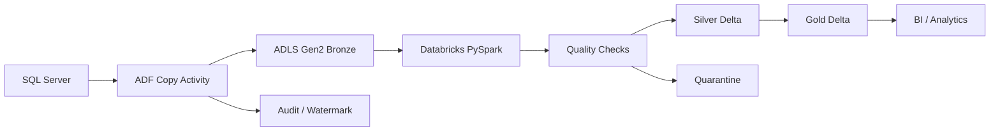

# Architecture Design

## Logical flow

## Layer responsibilities

### Bronze
Raw source-aligned data. Preserve source values and ingestion metadata.

### Silver
Validated and standardized data. Apply schema, deduplication, business-quality checks and type normalization.

### Gold
Business-ready datasets and aggregates optimized for analytics.

## Incremental strategy

A source `updated_at` column acts as the watermark. The control metadata stores the last successful value. Each run processes rows greater than the previous watermark and advances the watermark only after successful processing.

This follows the common ADF watermark pattern documented by Microsoft.
